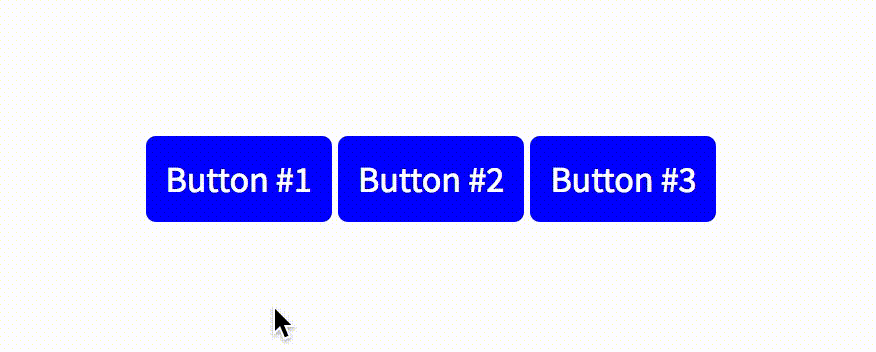

# ProbaClick

Do something when someone's probably going to click something.

[](https://travis-ci.org/alexmacarthur/probaclick)



## Overview

ProbaClick fires a callback when a user hovers over an element for a specified length of time. It's designed under the assumption that when a user spends a certain amount of time hovering over an item, it's likely that they're about click or interact with it in some way. By anticipating that click, you're able to perform an action before the user actually does it.

## Use Cases

The use cases are wide, but perhaps the most common is to dynamically fetch resources when it's likely that a user will click on a link. 

## Usage

To use, pass a NodeList, Node, or string selector, and define your options.

```js
//-- Turn each button red when it's hovered over for a second.
ProbaClick(document.querySelectorAll('button'), {
    callback: function (element) {
        element.style.background = 'red';
    }, 
    delay: 1000
});
```

## Arguments

### Elements
Any of the following are valid: 

```js
ProbaClick(document.querySelectorAll('a.class')) // ...
```

```js
ProbaClick(document.querySelector('a.class')) // ... 
```

```js
ProbaClick('a.class') // ...
```

### Options

|Option|Description|Default|
|---|---|---|
|callback|The function that will fire after the delay is met.|`function(){}`|
|delay|The amount of milliseconds to wait before firing the callback.|`500`|
|max|The maximum number of times the callback will fire after repeatedly hovering over it. Not specifying this value will allow the callback to fire over and over with no limit as a user meets the hover threshold. After the max has been met, event listeners will be removed. |false|
